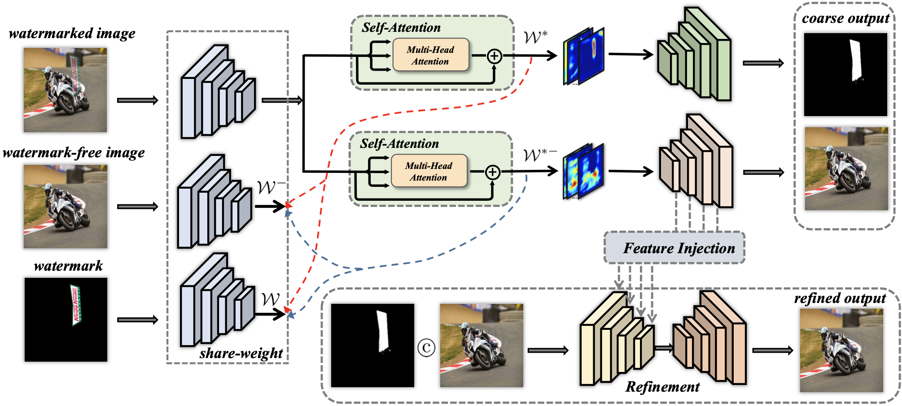

## DENet: Disentangled Embedding Network for Visible Watermark Removal

## Introduction

In this paper, we propose a novel contrastive learning mechanism to disentangle the high-level embedding semantic information of the images and watermarks, driving the respective network branch more oriented. Specifically, the proposed mechanism is leveraged for watermark images decomposition, which aims to decouple the clean image and watermark hints in the high-level embedding space. This can guarantee the learning representation of the restored image enjoy more task-specific cues. In addition, we introduce a self-attention-based enhancement module, which promotes the network's ability to capture semantic information among different regions, leading to further improvement on the contrastive learning mechanism. To validate the effectiveness of our proposed method, extensive experiments are conducted on different challenging benchmarks. Experimental evaluations show that our approach can achieve state-of-the-art performance and yield high-quality images.

## Network

## Training

Code coming soon!

## Acknowledgement

