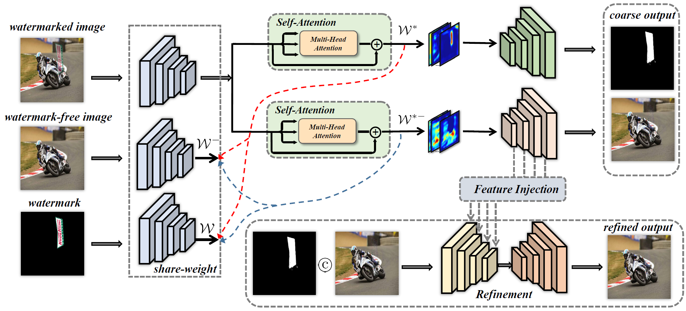

# DENet: Disentangled Embedding Network for Visible Watermark Removal

This is official implementation for paper **DENet: Disentangled Embedding Network for Visible Watermark Removal** [[AAAI2023 Oral](https://ojs.aaai.org/index.php/AAAI/article/view/25337)]



## Dataset preparation
~~~
|--data
|--|--LOGO
   |--|--10kmid
   |--|--10kgray
   |--|--10khigh
~~~

## Pretrained Model

|      |   PSNR   |   SSIM   |   LPIPS   |
| ---- | ---- | ---- | ---- |
|   [LOGO-L](https://drive.google.com/file/d/1SF8crHbg5RG89S0lvtSOnScyaUHX0nsX/view?usp=drive_link)  |  44.24 | 0.9954 | 0.54 |
|   [LOGO-H](https://drive.google.com/file/d/1MA8mYDlvOg1XA1YUb7v1mJu4sAgT6x4Z/view?usp=sharing)   | 40.83 | 0.9919 | 0.89 |
|   [LOGO-Gray](https://drive.google.com/file/d/1yuWhQHp8spZcOVnn2HHynzpXCoxLAgEK/view?usp=drive_link)   | 42.60 | 0.9944 | 0.53 |

## Installation
```bash
pip install -r requirements.txt
```
## Training
### Train on LOGO-H
```bash
bash scripts/train_contrast_attention_on_logo_high.sh 
```
### Train on LOGO-L
```bash
bash scripts/train_contrast_attention_on_logo_mid.sh 
```
### Train on LOGO-Gray
```bash
bash scripts/train_contrast_attention_on_logo_gray.sh
```

## Testing
### Test on LOGO-H
```bash
bash scripts/test_LOGO_10khigh.sh
```
### Test on LOGO-L
```bash
bash scripts/test_LOGO_10kmid.sh
```
### Test on LOGO-Gray
```bash
bash scripts/test_LOGO_10kgray.sh
```

## Acknowledgements
This code is mainly based on the previous work [SLBR](https://github.com/bcmi/SLBR-Visible-Watermark-Removal).